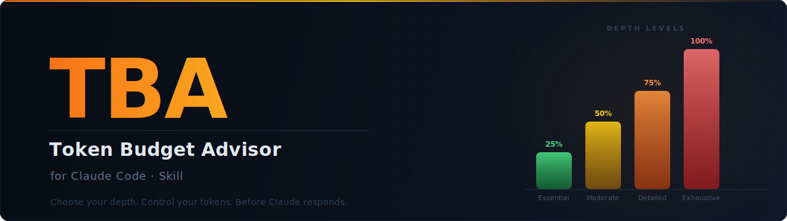

<p align="center">
  
</p>

> A Claude Code skill that intercepts your prompt, estimates token consumption, and lets you choose **how deep** you want the answer — before Claude responds.

---

## What is TBA?

When you ask Claude something, you often don't know if you'll get a 3-sentence answer or a 10-page essay. TBA gives you **control over that** by showing you token estimates upfront and letting you pick the depth level you actually need.

```
You:    "Explain how Transformer architecture works, including attention
         mechanisms, encoder/decoder layers, and how it compares to RNNs."

Claude: Analyzing your prompt...

        Input: ~54 tokens  |  Type: Natural  |  Complexity: Complex  |  Spanish

        Choose your depth level:

        [1] Essential   (25%)  ->  ~430 tokens   Direct answer only
        [2] Moderate    (50%)  ->  ~604 tokens   Answer + context + 1 example
        [3] Detailed    (75%)  ->  ~776 tokens   Full answer with alternatives
        [4] Exhaustive (100%)  ->  ~920 tokens   Everything, no limits

        Which level do you prefer?

You:    2

Claude: [Responds at 50% depth]
```

No guessing. No over-engineering. You decide.

---

## Installation

TBA is a Claude Code skill — a folder you place inside `.claude/skills/` in your project (or globally in `~/.claude/skills/`).

### Option 1 — npx (one command, no clone needed)

```bash
# Install in current project (.claude/skills/)
npx token-budget-advisor

# Install globally (~/.claude/skills/, all projects)
npx token-budget-advisor --global
```

### Option 2 — Clone directly into your project

```bash
git clone https://github.com/Xabilimon1/Token-Budget-Advisor-Claude-Code-.git \
  .claude/skills/token-budget-advisor
```

### Option 3 — Git submodule (for teams)

```bash
git submodule add https://github.com/Xabilimon1/Token-Budget-Advisor-Claude-Code-.git \
  .claude/skills/token-budget-advisor
```

> **Requirements:** Python 3.8+ (standard library only, no pip installs needed)

---

## How it works

```
Your prompt
    |
    v
[SKILL.md] -- TBA intercepts the flow
    |
    v
[token_estimator.py] -- Analyzes the prompt
    |
    +--> Detects: language, content type, complexity
    +--> Estimates: input tokens + response tokens per level
    |
    v
Claude presents 4 depth options
    |
    v
You choose --> Claude responds at that depth
```

### The estimator engine

`scripts/token_estimator.py` uses a hybrid heuristic approach with zero external dependencies:

| Text length | Strategy |
|---|---|
| Short (< 50 chars) | Segmented count by token type (words, numbers, punctuation) |
| Long (>= 50 chars) | Calibrated ratio by detected content type |
| All | Weighted average of character-based and word-based estimates |

**Calibrated ratios:**

| Content type | Chars / Token |
|---|---|
| English natural | ~4.0 |
| Spanish natural | ~3.5 |
| Code | ~3.0 |
| JSON | ~2.8 |
| Markdown | ~3.3 |

**Measured accuracy: ~85-90%** vs. real BPE tokenizers (average error ~13.5%).

### Auto-detection

TBA automatically detects:

- **Language** — Spanish, English, Code, Mixed
- **Content type** — Natural text, Code, JSON, Markdown
- **Complexity** — Simple, Medium, Medium-High, Complex, Creative

Complexity determines the response multiplier range used to estimate how long Claude's answer will actually be.

---

## Depth levels

| Level | Target length | What's included | What's omitted |
|---|---|---|---|
| **25% Essential** | 2-4 sentences | Direct answer, key conclusion | Context, examples, nuance, alternatives |
| **50% Moderate** | 1-3 paragraphs | Answer + necessary context + 1 example | Deep analysis, edge cases, references |
| **75% Detailed** | Structured response | Multiple examples, pros/cons, alternatives | Extreme edge cases, exhaustive references |
| **100% Exhaustive** | No limit | Everything — full analysis, all code, all perspectives | Nothing |

### Shortcuts — skip the question

If you already know what you want, TBA won't ask. Just say it:

| What you say | TBA uses |
|---|---|
| "in 25%" / "short version" / "tldr" / "summary" | 25% |
| "in 50%" / "moderate" / "normal" | 50% |
| "in 75%" / "detailed" / "complete" | 75% |
| "in 100%" / "exhaustive" / "everything" / "no limit" | 100% |

If you set a level in a previous message in the same session, TBA keeps it for subsequent responses without asking again — until you change it.

---

## Project structure

```
token-budget-advisor/
|
+-- SKILL.md                  <- Main instructions (what Claude reads)
|
+-- scripts/
|   +-- token_estimator.py    <- Token estimation engine (standalone)
|
+-- references/
|   +-- calibration.md        <- Tokenization ratios and complexity multipliers
|
+-- examples/
|   +-- sample_prompts.json   <- Sample prompts with expected analysis output
|
+-- README.md                 <- This file
+-- LICENSE                   <- MIT
```

---

## Using the estimator directly (CLI)

The estimator also works as a standalone CLI tool:

```bash
# Analyze text inline
python3 .claude/skills/token-budget-advisor/scripts/token_estimator.py \
  --text "Your prompt here"

# Analyze from a file
python3 .claude/skills/token-budget-advisor/scripts/token_estimator.py \
  --file my_prompt.txt
```

**Output (always JSON):**

```json
{
  "input_tokens": 54,
  "detected_language": "es",
  "detected_type": "natural",
  "complexity": "compleja",
  "char_count": 178,
  "word_count": 31,
  "response_estimates": {
    "25": 431,
    "50": 604,
    "75": 776,
    "100": 920
  },
  "total_estimates": {
    "25": 485,
    "50": 658,
    "75": 830,
    "100": 974
  },
  "precision_note": "Heuristic estimate with ~85-90% accuracy. Actual values may vary +-15%."
}
```

---

## Limitations

- **No real tokenizer** — uses calibrated heuristics, not Claude's actual BPE tokenizer. Accuracy: ~85-90%.
- **No session limit access** — can't tell you how many tokens you have left in your plan (that's server-side).
- **Response estimates are approximations** — based on prompt complexity, not what Claude will actually generate.
- **Edge cases** — very short texts (< 10 chars) or heavy emoji/Unicode content may be less accurate.
- **Works 100% offline** — no network calls, no API keys, standard Python 3.8+.

---

## License

MIT — use it, modify it, share it.
